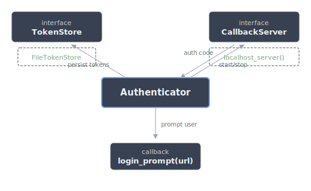
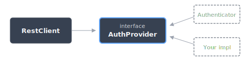

Authentication
==============

Schwab uses OAuth2 with a 30-minute access token and a 7-day refresh
token. Sectorem's auth layer manages this lifecycle automatically.

Components
----------

The :class:`~sectorem.auth.manager.Authenticator` orchestrates three pluggable
pieces:

- **TokenStore** — persists tokens across restarts. The built-in
  :class:`~sectorem.auth.token.FileTokenStore` writes JSON to disk;
  implement :class:`~sectorem.auth.token.TokenStore` for other backends.
- **CallbackServer** — receives the OAuth redirect from Schwab.
  The default :func:`~sectorem.auth.server.localhost_server` runs HTTPS
  on ``127.0.0.1:8443`` with a bundled self-signed certificate.
- **login_prompt** — an async callback that presents the
  authorization URL to the user. Defaults to printing to stdout.

The rest of the library never touches the Authenticator directly.
It depends only on the :class:`~sectorem.auth.manager.AuthProvider` interface:

This means you can swap in your own token source without changing
any client code.

Token Lifecycle
---------------

The :class:`~sectorem.auth.manager.Authenticator` handles all stages of the
token life cycle:

- **Refreshes** the access token ~60 seconds before it expires
  (configurable via ``access_refresh_buffer``).
- **Prompts** for re-authorization one day before the refresh token
  expires (configurable via ``reauth_threshold``).
- **Raises** :class:`~sectorem.errors.NotAuthenticatedError` on API
  calls if the refresh token has fully expired, until the user
  completes re-authorization.

Tokens are persisted via a :class:`~sectorem.auth.token.TokenStore` backend.
The built-in :class:`~sectorem.auth.token.FileTokenStore` writes JSON to disk
using aiofiles.

Custom Auth Provider
--------------------

The :class:`~sectorem.auth.manager.Authenticator` is decoupled from the rest of
the code meaning that the API clients can be used without it. Instead, they
depend only on the :class:`~sectorem.auth.manager.AuthProvider` interface,
which requires a single async method: ``get_access_token()``.

If you need to separate token acquisition from consumption (e.g. one service
handles login, many services use the token), implement
:class:`~sectorem.auth.manager.AuthProvider`::

    from sectorem.auth import AuthProvider
    from sectorem.errors import NotAuthenticatedError

    class RedisAuthProvider(AuthProvider):
        def __init__(self, redis):
            super().__init__()
            self._redis = redis

        async def get_access_token(self) -> str:
            token = await self._redis.get("schwab:access_token")
            if token is None:
                raise NotAuthenticatedError("No token in Redis")
            return token

Then pass it to any client::

    auth = RedisAuthProvider(redis)
    trader = TraderClient(auth)

Custom Callback Server
----------------------

The default callback server uses HTTPS on ``127.0.0.1:8443`` with a
bundled self-signed certificate, but the whole thing is pluggable via
:class:`~sectorem.auth.server.CallbackServer`. For example, if you are already
using this library inside a web application and don't want to start a separate
server just for the authentication callback, you would just subclass
``CallbackServer`` and wire the callback into your existing code.

- Running behind a reverse proxy that terminates TLS and forwards to an
  internal HTTP server. 

To use your own server (e.g. behind
a reverse proxy or integrated into an existing web app), implement
:class:`~sectorem.auth.server.CallbackServer` and pass a factory to the
:class:`~sectorem.auth.manager.Authenticator`::

    from sectorem.auth import Authenticator, CallbackServer

    class MyCallbackServer(CallbackServer):
        @property
        def url(self) -> str:
            return "https://myapp.example.com/schwab/callback"

        async def start(self) -> None:
            pass  # already running

        async def stop(self) -> None:
            pass

    async def my_server_factory(callback):
        server = MyCallbackServer()
        # Wire `callback` into your existing route handler
        return server

    auth = Authenticator(
        app_key="...",
        app_secret="...",
        token_store=store,
        server_factory=my_server_factory,
    )

Custom Login Prompt
-------------------

By default, the :class:`~sectorem.auth.manager.Authenticator` prints the
authorization URL to stdout. You can replace this with any async callable
that takes a URL string — open a browser, send a push notification, post
to Slack, whatever fits your workflow::

    import webbrowser

    async def browser_prompt(url: str) -> None:
        webbrowser.open(url)

    auth = Authenticator(
        app_key="...",
        app_secret="...",
        token_store=store,
        login_prompt=browser_prompt,
    )

A bound method works too::

    class MyApp:
        async def on_schwab_login(self, url: str) -> None:
            await self.notify_user(f"Please authorize: {url}")

    app = MyApp()
    auth = Authenticator(..., login_prompt=app.on_schwab_login)

API Reference
-------------

.. autoclass:: sectorem.auth.AuthProvider
   :members:

.. autoclass:: sectorem.auth.Authenticator
   :members:

.. autoclass:: sectorem.auth.AuthState
   :members:
   :undoc-members:

.. autoclass:: sectorem.auth.token.Token
   :members:

.. autoclass:: sectorem.auth.token.TokenStore
   :members:

.. autoclass:: sectorem.auth.token.FileTokenStore
   :members:

.. autoclass:: sectorem.auth.server.CallbackServer
   :members:

.. autoclass:: sectorem.auth.server.AiohttpCallbackServer
   :members:

.. autofunction:: sectorem.auth.server.localhost_server
